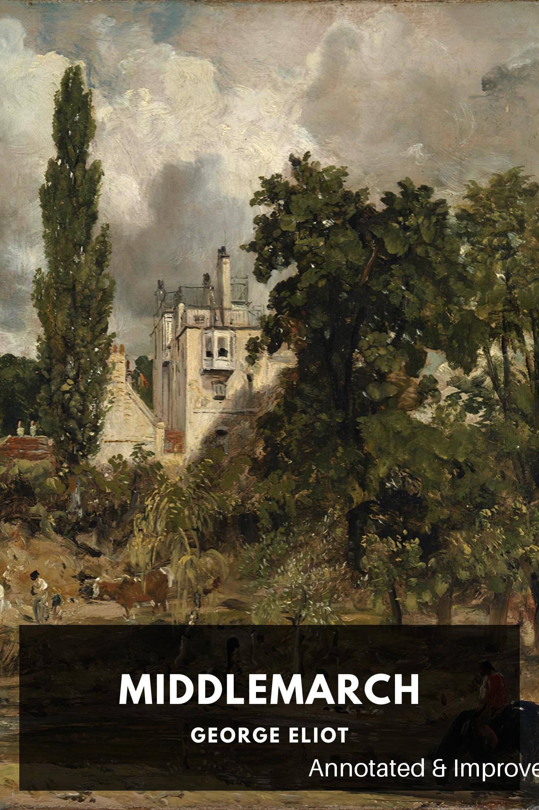

# Middlemarch, Annotated & Impro—

[download ebook](annotated_george-eliot_middlemarch.epub)

This is an experiment in augmenting epub files with playful LLM-generated annotations.
The code currently runs just on George Eliot's _Middlemarch_ via [Standard Ebooks](https://standardebooks.org/ebooks/george-eliot/middlemarch).

The annotated book begins with a Publisher's Note to explain the changes:

> Publisher's Note
> 
> In the event that the Publisher's persistent solicitations for consent to issue this edition have, by some misfortune, been consigned to the depths of the ocean while in transit to their intended recipient, and with a disposition to ascribe the noblest of intentions to those from whom an explicit dissent has not been forthcoming, the Publisher has ventured to proceed with this publication in the hopeful anticipation of eventually being graced with the permissions requested.
> The text herein has not only been transmitted to the reader with fidelity, but also enhanced, through the application of certain ingenious contrivances originated by the Publisher himself. These enhancements include the following:
> 
> * A précis, or argument, has been prefixed to each chapter, designed to more keenly engage the reader's interest in the unfolding story and to whet the appetite for subsequent chapters.
> * Following each chapter, a concise dialogue amongst various simulated personages is presented, to more vividly expound upon the chapter's principal themes and notions.
> * In instances where the original manuscript appears to lack a sentence – perhaps owing to the oversight of the typesetter or a mishap of transcription – the Publisher has undertaken to interpose a sentence of his own crafting, mirroring the original author's style, to mend the breach. This regrettable but necessary intervention is required approximately once per chapter.
> * The Publisher has interspersed, at judicious intervals, various asides, reflections, or clarifications in the form of footnotes, to satiate the reader's thirst for broader understanding.
> * An illustration, executed by means of a mathematical distillation process of the most advanced sort and based on a catalog of no little extent whose contents the Publisher cannot entirely recall, has been inserted into each chapter to more vividly depict the principal events and characters.
> 			
> Through these means, it is fervently hoped that the reader will discover this text to be substantially more rewarding than any prior editions procurable from the initial printers or any competing quarters.
> With the greatest of enthusiastic respect, your humble servant,
> The Publisher

## Artist statement / Ruining the joke

I (Jack, not the fictional Publisher) am interested in whether and how LLMs can make unfamiliar literature more approachable –
it would make sense if they can do that, as part of their function as [universal translators](https://lil.law.harvard.edu/blog/2023/11/29/llms-are-universal-translators/).

Middlemarch is a good chance to test that idea since I personally find it a little hard to engage with. The tweaks
here are experiments in tricking me into engaging with the text – does
it help if I have a précis that keeps me oriented? Does it help if I have chatty footnotes, or observations of imaginary
characters who are reading the book with me, or an illustration that gives each chapter a unique visual association, or
the knowledge that one sentence per chapter is a forgery I might detect?

Or conversely, maybe the point of a book, like the point of a darkened theater for a movie, is to adopt its reality,
and anything that engages your brain in other directions will just slow that down. It's fun to read this and 
introspect -- are you drawn further in or pushed out by annotations? I'd like this to work, at least for some readers,
because there's millions of books out there that have drifted far enough from contemporary language that an onramp might help.

I've found that gpt-4 is only barely up to this task for now -- its attempts to simulate what human readers or annotators
of *Middlemarch* might say tend to be so formulaic and uninsightful
that they don't work even as fiction; or if I turn up the temperature they descend into babble right when they're
getting interesting. I'm not sure if better prompting or pipelines would help, but in the meantime I'm trying the
framing device of an over-zealous but incompetent rogue Publisher and his mechanical minions. I'm hoping that
some of these experiments work just as well if the reader can look forward to laughing at them rather than with them.

## Running the code

    pip install -r requirements.txt
    python annotate.py

This will unpack `george-eliot_middlemarch.epub` into `before/`, run a series of gpt-4 prompts on each chapter, and write
results to `work_dir/` and to `annotated_george-eliot_middlemarch.epub`.